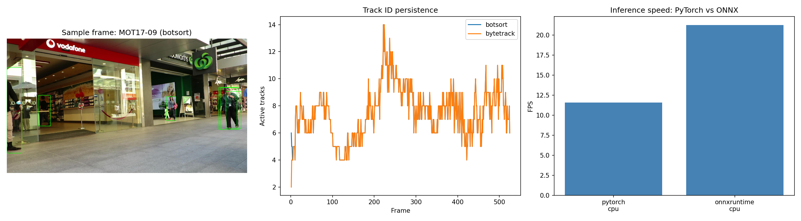

# Real-Time Multi-Object Tracking Pipeline (MOT17)

An end-to-end pedestrian detection + multi-object tracking pipeline for real-time
video monitoring: fine-tunes a YOLO detector on MOT17, tracks people across frames
with BoT-SORT and ByteTrack, exports the detector to ONNX for optimised inference,
and reports the full MOT metric suite (HOTA / MOTA / IDF1) alongside a measured
PyTorch-vs-ONNX speedup. Everything is config-driven, typed, tested, and CI-backed.



*(A short animated GIF of the tracked video is a nice-to-have, not yet added —
generate one anytime with `make gif`; see [Running the pipeline](#running-the-pipeline).)*

## Results

| Metric | Value |
|---|---|
| mAP@0.5 (detection) | 0.606 |
| mAP@0.5:0.95 (detection) | 0.331 |
| BoT-SORT — HOTA / MOTA / IDF1 | unavailable\* / 0.522 / 0.472 |
| ByteTrack — HOTA / MOTA / IDF1 | unavailable\* / 0.522 / 0.472 |
| PyTorch FPS (CPU) | 11.6 (86.4 ms/frame) |
| ONNX FPS (CPU) | 21.3 (47.0 ms/frame) |
| Measured ONNX speedup | 1.84× |

\* HOTA requires the optional `trackeval` install (`pip install -e ".[trackeval]"`),
which wasn't installed for this run — MOTA/IDF1 are the documented fallback (see
[Design notes](#design-notes)), not a bug or omission.

Numbers are written to `outputs/metrics.json` by `scripts/evaluate.py` (committed
alongside this README) and are always the real measured values for whatever run
produced them — full run: 30 epochs, all 5 train sequences, imgsz 640, on a Kaggle
T4 GPU; benchmark numbers are CPU-only (`benchmark.devices: ["cpu"]` in
`configs/default.yaml`).

## Pipeline overview

```
raw MOT17  ─▶  prepare_dataset  ─▶  train  ─▶  track  ─▶  export  ─▶  benchmark  ─▶  evaluate
 (gt.txt)        (YOLO labels        (YOLO26n      (BoT-SORT /    (ONNX,        (PyTorch vs    (HOTA/MOTA/IDF1,
                  + dataset.yaml)     fine-tune)     ByteTrack)     opset 13)     ONNX, CPU/GPU)  metrics.json,
                                                                                                   results figure)
```

Each stage is a thin CLI in `scripts/` that loads a validated config and calls a
library function in `src/mot_pipeline/`; nothing is hardcoded — every path,
hyperparameter, sequence name, and threshold comes from `configs/*.yaml`.

## Getting the dataset

MOT17 is **not** included in this repo (`data/` is gitignored). Get it from one of:

1. **Official source (MOTChallenge):** <https://motchallenge.net/data/MOT17/> — download
   `MOT17.zip` (~5.5 GB) and extract it.
2. **Kaggle:** search Kaggle Datasets for "MOT17" and attach one directly to your
   notebook — no manual download needed if you're training there (see below).

**Where to put it:**

- **Running locally:** extract so that `data/MOT17/train/...` and `data/MOT17/test/...`
  exist under the repo root (matches `paths.raw_dir: data/MOT17` in `configs/default.yaml`).
  Only `train/` has public ground truth and is ever used (see [Design notes](#design-notes)).
- **Running on Kaggle/Colab** (recommended if you don't have a local GPU): attach the
  MOT17 dataset to your notebook, then pass `--override configs/kaggle.yaml`, which
  points `raw_dir` at Kaggle's read-only `/kaggle/input/...` mount and everything else
  (`converted_dir`, `weights_dir`, `outputs_dir`) at the writable `/kaggle/working/...`.
  Check the dataset's actual extracted folder name with `ls /kaggle/input/` and adjust
  `configs/kaggle.yaml` if it differs from the placeholder path there.

## Setup

```bash
git clone <this-repo>
cd mot-tracking-pipeline
make setup          # pip install -e ".[dev]" + pre-commit hooks
```

Requires Python 3.10+. `requirements.txt` has pinned versions; generate a full
lockfile with `pip install -r requirements.txt && pip freeze > requirements.lock`.

## Running the pipeline

Smoke mode validates the entire pipeline end-to-end on CPU in a couple of minutes,
using one sequence per split, one epoch, and a 2% data fraction:

```bash
make smoke
```

Each stage individually (full config, GPU by default — override `detection.device`
for CPU):

```bash
make prepare    # raw MOT17 -> YOLO dataset + dataset.yaml
make train      # fine-tune the detector
make track      # detect+track the eval sequence with both trackers
make export     # export to ONNX + parity check
make benchmark  # PyTorch vs ONNX speed, per configured device
make evaluate   # HOTA/MOTA/IDF1 + outputs/metrics.json + results_summary.png
make gif        # short GIF clip of the tracked video, for this README
make all        # prepare -> train -> track -> export -> benchmark -> evaluate
```

Every target accepts config overrides; `--override` is repeatable and applied in
order, so you can combine `smoke.yaml` (tiny run) with `kaggle.yaml` (paths) for a
quick Kaggle validation before a full run:

```bash
# Quick end-to-end smoke test on Kaggle, with Kaggle's path layout:
python scripts/prepare_dataset.py --config configs/default.yaml \
    --override configs/smoke.yaml --override configs/kaggle.yaml

# Full run on Kaggle:
python scripts/train.py --config configs/default.yaml \
    --override configs/kaggle.yaml --set detection.epochs=50
```

Quality gates:

```bash
make lint        # ruff check + format --check
make typecheck   # mypy src/
make test        # pytest (fast, no dataset/model required)
```

## Design notes

**The train/val split is load-bearing.** Only `MOT17-02, 04, 05, 09, 10, 11, 13` ship
with public ground truth; the rest (`01, 03, 06, 07, 08, 12, 14`) are the MOTChallenge
*test* set and have no GT, so metrics on them are uncomputable. This repo holds out
whole sequences from the labelled train set (`MOT17-09`, `MOT17-10` for val/tracking
eval) rather than splitting frames within a sequence, because tracking evaluation
needs continuous, unbroken sequences — frame-level splitting would leak temporally and
make the tracking metrics meaningless. `mot_pipeline.config.SplitConfig` enforces this
at config-validation time (no GT-less sequence can enter a split; train/val must be
disjoint), and `mot_pipeline.data.split` enforces it again against what's actually on
disk before any conversion happens.

**MOT17 ships each sequence three times** (`-DPM`, `-FRCNN`, `-SDP`) with identical
images/GT and only the bundled public detections differing. Since detection comes from
our own fine-tuned model, public detections are never used; `mot_pipeline.data.mot17`
deduplicates to one directory per base sequence name.

**Detector/tracker choice:** `yolo26n.pt` is Ultralytics' NMS-free, DFL-free nano
detector — a lighter head than prior YOLO generations gives a cleaner ONNX export (no
external NMS post-processing) and a strong CPU/ONNX speedup, which is the point of the
export/benchmark stages. If YOLO26 weights or export misbehave in your environment,
`detection.model: yolo11n.pt` is the documented fallback (just change the config value).
Both **BoT-SORT** (camera-motion compensation, optionally ReID, generally higher
accuracy) and **ByteTrack** (simpler, faster) are run and reported as a comparison
rather than picking one a priori.

**Smoke vs full mode:** `configs/smoke.yaml` is deep-merged on top of
`configs/default.yaml` to shrink everything (one sequence per split, 1 epoch, 2% data
fraction, CPU, 10 benchmark frames) so the whole pipeline can be validated cheaply
before committing to a full run. `configs/kaggle.yaml` does the equivalent for path
placement on Kaggle's read-only/writable split, leaving hyperparameters at their full
defaults.

**HOTA is best-effort.** MOTA/IDF1 are computed directly from our own MOTChallenge
files via `py-motmetrics`, which needs no special folder layout. HOTA goes through the
official `trackeval` toolkit, which does require a specific on-disk layout;
`mot_pipeline.evaluation.mot_metrics` builds that layout under a temp directory, but if
`trackeval` isn't installed or its evaluation fails for any reason, HOTA is reported as
`null`/"unavailable" with a logged warning rather than crashing the run — MOTA/IDF1 are
still computed either way. Install the optional extra for HOTA: `pip install -e ".[trackeval]"`.

## Licensing

This project's own code is MIT-licensed (see `LICENSE`). It depends on
[Ultralytics](https://github.com/ultralytics/ultralytics) (YOLO + built-in trackers),
which is licensed **AGPL-3.0**. Using `ultralytics` in a derivative work — especially
one offered as a network service — may impose AGPL-3.0 obligations on that derivative
work. If you fork this for something beyond personal/research use, either keep the
whole result AGPL-3.0 or replace the Ultralytics dependency.

## Limitations & possible extensions

- Tracking metrics are computed on a single eval sequence (`MOT17-09` by default);
  `split.eval_sequence` and `split.val_sequences` can be widened to a second sequence
  for a more robust comparison table.
- HOTA depends on the optional `trackeval` install; without it, only MOTA/IDF1 are
  available (clearly marked as such in `metrics.json`).
- No instance segmentation, edge (TensorRT/OpenVINO) export, INT8 quantisation, or
  synthetic-data augmentation yet — each is a natural, isolated extension on top of the
  existing config/CLI structure (e.g. add `yolo26n-seg` as a `detection.model` option,
  or a new `export.format` value) rather than a fork.
- DVC dataset versioning alongside the existing MLflow experiment tracking is a
  reasonable addition if the dataset/conversion pipeline grows more complex.
